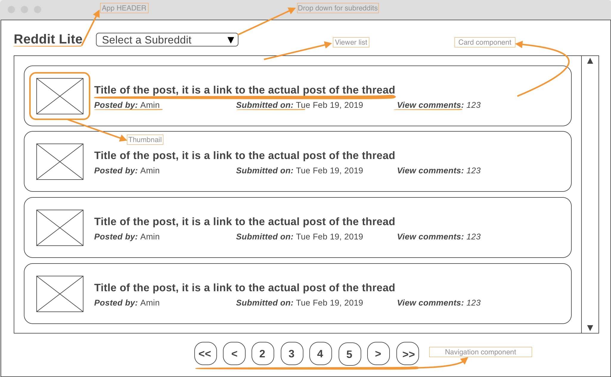

# reddit-lite

### Reddit viewer to display 25 reddit posts, requirements as follows:

- Using the reddit API https://www.reddit.com/dev/api/, i.e https://www.reddit.com/r/news.json, this will return json data back.
- Display each post include a title, link to the post, thumbnail if exists, the user, time submitted, and link to the comments.
- Refresh the data every minute. Don't loose the position of the page.
- Use default color/css scheme
- Example of a subreddit: https://www.reddit.com/r/news
- Create unit and integreation tests to the application
- Use React and Redux libraries to create the app and manage state

### First, let's setup the dev environment:-
- Will need to create the application skeleton using the create-react-app, that will bundle the app and add all the tools to compile/transpile the code. Since React uses JSX (javascript xml) and the browser understands JavaScript objects, we need to convert JSX to JS.
- As per the documentation from reactjs.org, we can use create-react-app library to bundle the app with all the tools that will transpile JSX to JS.
- Let's create the initial skeleton app.
  - npx create-react-app .
  - This will create the initial app and adds react, react-dom
  - launch the reddit-lite app
  - yarn start
    - will launch the app to localhost:3000 <-- default port
    - this will give us hot reloading and we can start building the application
### Let's make first changes, the app will reload and changes are reflected:
  - remove boilerplate files (css, react logo, text...) that comes from the initial creation
  - add reddit icon and title "Reddit Lite".
  - make sure app is reloaded
  - the app is now working.

### Start with a mockup for what we will deliver based on the requirements above.

  - Using wireframe mockup tool to create the user interface that we are going after, here is the link to the mockup: https://wireframe.cc/uGcekK

  - Attched to the project a screen shot of the UI layout.
  - 
  - 